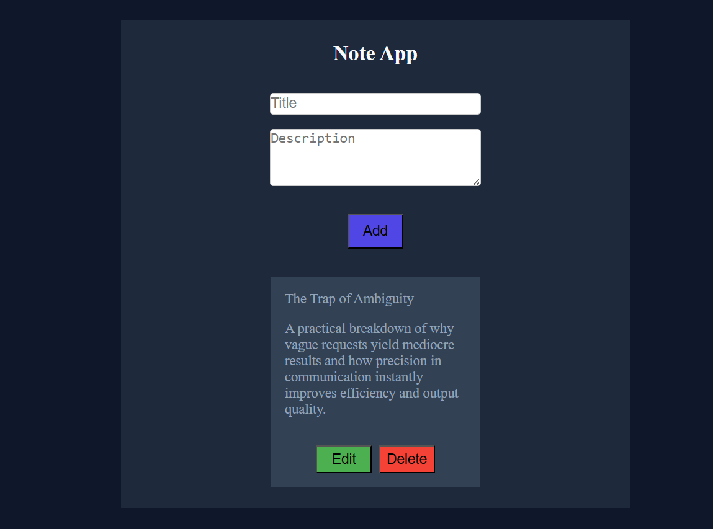

# 📌 Dynamic Notes App (Vanilla JavaScript)

---

## 🚀 Overview

A dynamic notes application built using Vanilla JavaScript that allows users to create, edit, update, and delete notes with real-time UI updates.

This project focuses on proper UI state management, DOM manipulation, and clean code structure.

---

## ✨ Features

- Add notes with title and description  
- Edit existing notes  
- Save updated changes  
- Cancel edits and restore previous data  
- Delete notes  
- Input validation (prevents empty or invalid entries)  
- Dynamic UI updates without page reload  

---

## 🧠 Core Concepts Used

- DOM Manipulation  
- Event Handling  
- UI State Management (View Mode ↔ Edit Mode)  
- Dynamic Rendering using JavaScript  
- Separation of Concerns (logic vs UI)  
- Input Validation  

---

## 🔧 Technical Implementation

- Built reusable functions:
  - `renderViewMode()`
  - `renderEditMode()`
- Implemented full UI re-rendering instead of partial DOM updates  
- Ensured proper event binding for dynamically created elements  
- Removed nested event listeners and duplicate logic  
- Handled variable scope issues correctly  
- Used class-based styling for UI state (edit mode)  

---

## 🎨 UI Improvements

- Used Flexbox for button alignment  
- Improved spacing and layout structure  
- Added visual distinction for edit mode  
- Cleared input fields after adding notes  
- Added hover interaction for better UX  

---

## ⚠️ Challenges Faced

- Edit functionality working only once  
- Event listeners not working on dynamic elements  
- Over-complicated nested logic  
- Confusion between `.value` and `.textContent`  
- Managing UI state transitions correctly  

---

## 💡 Key Learnings

- Always reattach event listeners to newly created elements  
- Avoid mixing multiple UI update approaches  
- Prefer full UI re-rendering over patching DOM  
- Understand data flow (input → process → display)  
- Functions should be reusable and defined outside events  
- Validation must happen before using user input  

---

## 🌐 Live Demo

🔗 [ https://priyanshpanjabi0922.github.io/Notes-App/]

---

## 📸 Project Preview

---

## 🔜 Future Improvements

- Add animations and transitions  
- Improve UI design and responsiveness  
- Add keyboard shortcuts (Enter to save, Esc to cancel)  
- Store notes using local storage  

---
